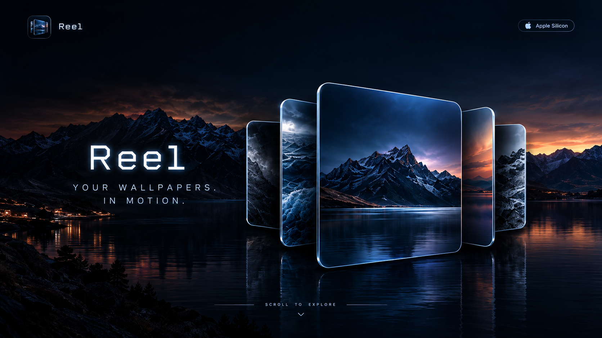

  

<h1><samp>R E E L</samp></h1>

<samp>YOUR WALLPAPERS. IN MOTION.</samp>

  
  
  

  

  <samp>⚡ BLAZING FAST</samp>
  &nbsp;&nbsp;&nbsp;·&nbsp;&nbsp;&nbsp;
  <samp>▧ BEAUTIFUL UI</samp>
  &nbsp;&nbsp;&nbsp;·&nbsp;&nbsp;&nbsp;
  <samp>⚙ SMART &amp; EFFICIENT</samp>
  &nbsp;&nbsp;&nbsp;·&nbsp;&nbsp;&nbsp;
  <samp>▣ YOUR WAY</samp>

  <samp>Fluid, seamless navigation &nbsp;·&nbsp; Clean, minimal and built for macOS 
  Optimised for performance and low memory use &nbsp;·&nbsp; Show names, numbers or hide them</samp>

<h2><samp>KEY FEATURES</samp></h2>

  <samp>→ Ultra-smooth navigation — trackpad, mouse and arrow keys</samp> 
  <samp>→ Stunning 3D carousel interface</samp> 
  <samp>→ File names, numbered labels or no labels</samp> 
  <samp>→ Optimised for Apple Silicon (M1 / M2 / M3 / M4 / M5)</samp> 
  <samp>→ Bounded thumbnail cache for predictable memory use</samp> 
  <samp>→ No background polling while the picker is closed</samp> 
  <samp>→ Fast, lightweight and designed for macOS</samp>

  

<h2><samp>ABOUT</samp></h2>

  <samp>Reel is built to make wallpaper browsing feel immediate: swipe, scroll or press an arrow key and the carousel stays fluid while background work stays low.</samp>

<h3><samp>PERFORMANCE</samp></h3>

  <samp>Continuous input is handled frame-by-frame. Thumbnail work is bounded and cancellable, and late decode results are ignored after the picker closes.</samp>

<h3><samp>LABELS</samp></h3>

  <samp>Labels are display-only. They never rename the actual files in Finder.</samp>

  <samp>01 / 02 / 03... &nbsp;&nbsp;•&nbsp;&nbsp; Original filename &nbsp;&nbsp;•&nbsp;&nbsp; Hidden</samp>

<h3><samp>REQUIREMENTS</samp></h3>

  <samp>macOS 14+ &nbsp;&nbsp;•&nbsp;&nbsp; Apple Silicon &nbsp;&nbsp;•&nbsp;&nbsp; Reel 1.1.1</samp>

<h3><samp>DOWNLOAD</samp></h3>

  <samp>The Apple-silicon DMG is distributed from Releases.</samp>

  <samp>R E E L &nbsp;&nbsp;//&nbsp;&nbsp; Y O U R &nbsp;&nbsp;W A L L P A P E R S . &nbsp;&nbsp;I N &nbsp;&nbsp;M O T I O N .</samp>

