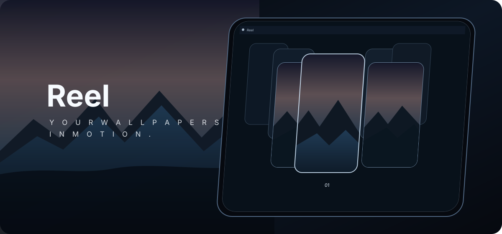

# Reel

  

<h1 align="center">Reel</h1>

  A fast, fluid macOS wallpaper picker built around a cinematic carousel.

  
  
  
  

## What is Reel?

Reel is a lightweight menu-bar utility for browsing and applying wallpapers with a responsive, cinematic carousel. It is designed to feel immediate during trackpad swipes and repeated arrow-key navigation while staying quiet when the picker is closed.

## Highlights

- Fluid trackpad momentum and continuous keyboard navigation
- Display-link animation that sleeps when the picker is settled
- Bounded thumbnail cache with on-demand decoding
- Immediate thumbnail-work cancellation and memory purge when the picker closes
- Apple-silicon arm64 release target
- Display-only labels: `01`, source filename, or hidden
- Low background workload when idle

## Preview

The preview above is a visual product mockup representing the interface direction; it is not a captured runtime screenshot.

## Install

The intended distribution is an Apple-silicon DMG from the project's GitHub Releases page.

## Build locally

On an Apple-silicon Mac with Xcode Command Line Tools installed, use the packaged release project and run its build script with the DMG option.

## Release

Current project version: **1.1.0**

Release notes and the Apple-silicon DMG pipeline are maintained with the project release package.

## Project status

This repository is currently being used as the private project home for Reel. The full release source package is maintained alongside the project build artifacts.

## License

Private project.
