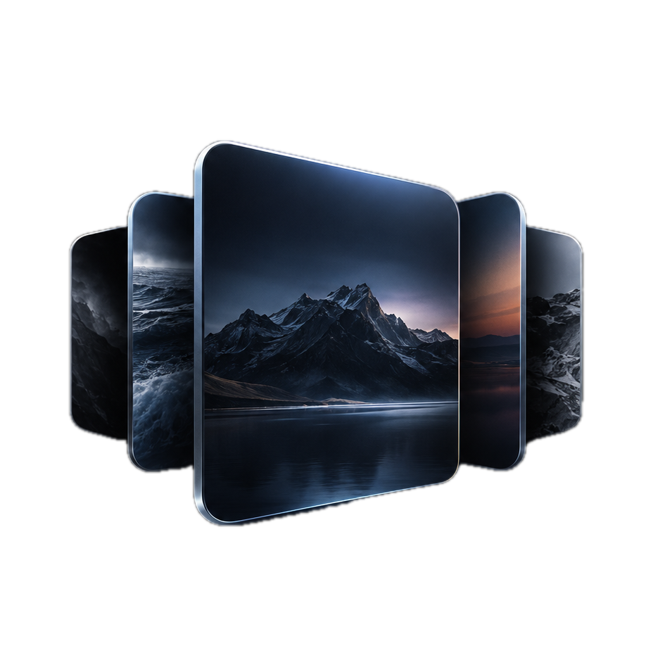
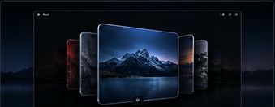

# <samp>R E E L</samp>

<samp>YOUR WALLPAPERS. IN MOTION.</samp>

 

  

  

 

<table>
<tr>
<td width="25%" valign="top">

### <samp>⚡ BLAZING FAST</samp>

<samp>Fluid, seamless navigation 
with zero lag.</samp>

</td>
<td width="25%" valign="top">

### <samp>▧ BEAUTIFUL UI</samp>

<samp>Clean, minimal and 
built for macOS.</samp>

</td>
<td width="25%" valign="top">

### <samp>⚙ SMART &amp; EFFICIENT</samp>

<samp>Optimised for performance 
and low memory usage.</samp>

</td>
<td width="25%" valign="top">

### <samp>▣ YOUR WAY</samp>

<samp>Show file names, numbers 
or hide them completely.</samp>

</td>
</tr>
</table>

  

<table>
<tr>
<td width="48%" valign="top">

## <samp>KEY FEATURES</samp>

<samp>→ Ultra-smooth navigation — trackpad, mouse and arrow keys</samp>

  

<samp>→ Stunning 3D carousel interface</samp>

  

<samp>→ File names, numbered labels or no labels</samp>

  

<samp>→ Optimised for Apple Silicon (M1 / M2 / M3 / M4)</samp>

  

<samp>→ Bounded thumbnail cache for predictable memory use</samp>

  

<samp>→ No background polling while the picker is closed</samp>

  

<samp>→ Fast, lightweight and designed for macOS</samp>

</td>
<td width="52%" valign="top">

</td>
</tr>
</table>

  

## <samp>ABOUT</samp>

<samp>Reel is built to make wallpaper browsing feel immediate: swipe, scroll or press an arrow key and the carousel stays fluid while background work stays low.</samp>

  

### <samp>PERFORMANCE</samp>

<samp>Continuous input is handled frame-by-frame. Thumbnail work is bounded and cancellable, and late decode results are ignored after the picker closes.</samp>

  

### <samp>LABELS</samp>

<samp>Labels are display-only. They never rename the actual files in Finder.</samp>

 

<samp>01 / 02 / 03... &nbsp;&nbsp;•&nbsp;&nbsp; Original filename &nbsp;&nbsp;•&nbsp;&nbsp; Hidden</samp>

  

### <samp>REQUIREMENTS</samp>

<samp>macOS 14+ &nbsp;&nbsp;•&nbsp;&nbsp; Apple Silicon &nbsp;&nbsp;•&nbsp;&nbsp; Reel 1.1.1</samp>

  

### <samp>DOWNLOAD</samp>

<samp>The Apple-silicon DMG is distributed from Releases.</samp>

<samp>REEL // YOUR WALLPAPERS. IN MOTION.</samp>

